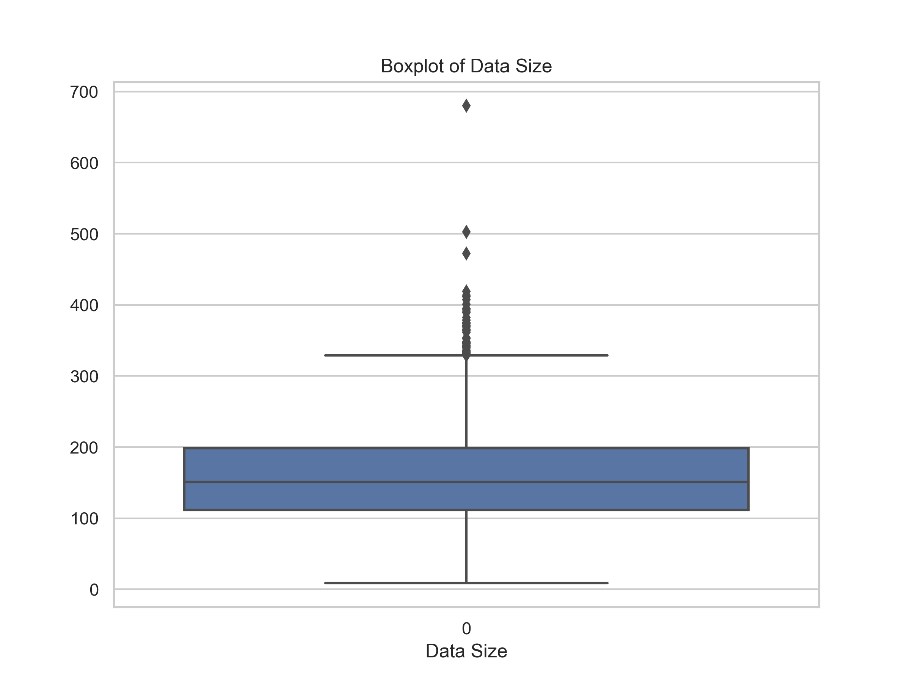
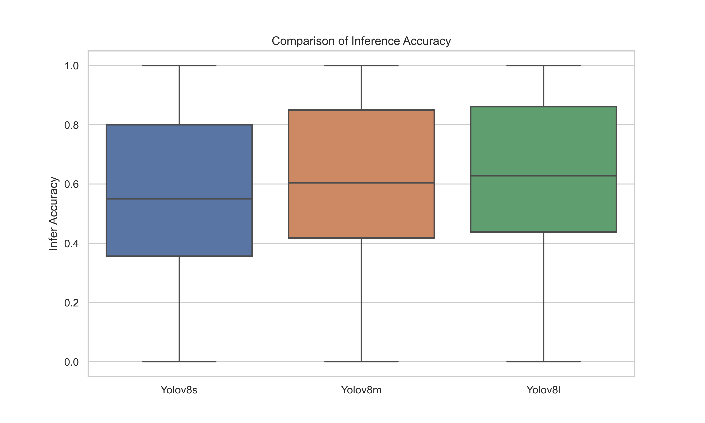
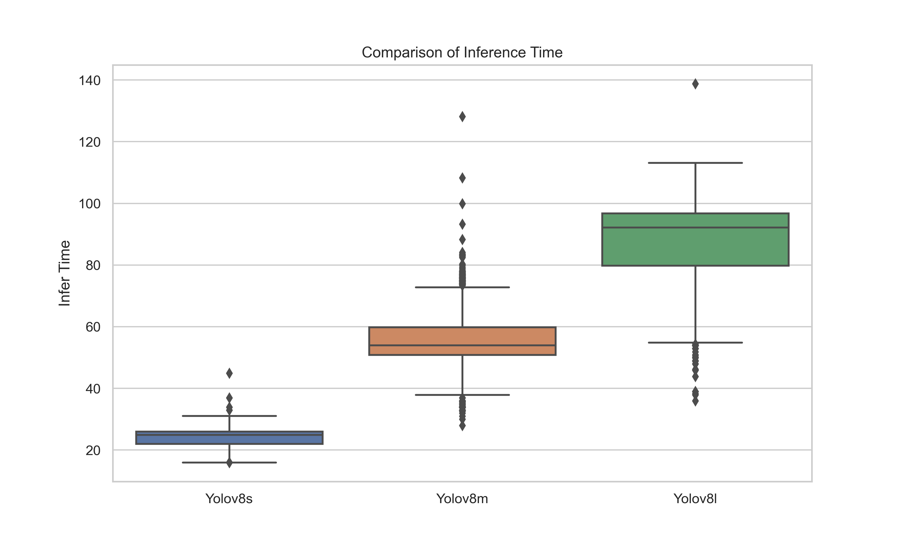

# InferTrack——DNN推理任务追踪数据集及代码

在计算机上运行两个典型推理任务（目标检测、实例分割）追踪到的精度和推理时间，可用于替代仿真评估中的任务数据分布。

## 结果分析
注：在yolov8执行目标检测过程中，由于类别标签的不对应，我们忽略对类别精度的计算而只对目标检测框位置的精度计算。

## 表头解释
注：infer_time与具体执行的计算机性能有关，利用该数据可以估计出执行一个任务推理所需的算力。我们所提供数据的运行设备参数为i5-9400F@2.9GHz，16GB内存和GeForce GTX 1650 4GB。
| 属性  |                表单1（maskrcnn）    |                         表单2（yolov8）               |
| :--: | :-------------------------------------------: | :----------------------------------------------------------: |
| 任务类型 |       实例分割（instance segmentation） |                    目标检测（object detection）                    |
|  模型  |            maskrcnn_resnet50            |    yolov8系列：yolov8nano,small,medium,large,extra_large     |
| data_size单位 |               KB               | KB |
| infer_time单位 |                 s                 | ms |
| 时间测定方式 | 手动python代码测定 | yolov8提供 |
| cycles | 基于CPU频率计算得出的CPU cycles | 无 |

## 引用

如果您使用过该数据集，我们将非常感谢您引用以下论文（虽然还未录用）：

- Junjie Zhang, Zheyi Chen, Xing Chen, Hongju Cheng, Jie Li, Geyong Min. Traffic-cognitive Slicing for Resource-efficient Offloadingwith Dual-distillation DRL in Multi-edge Systems. IEEE Transactions on Mobile Computing.
